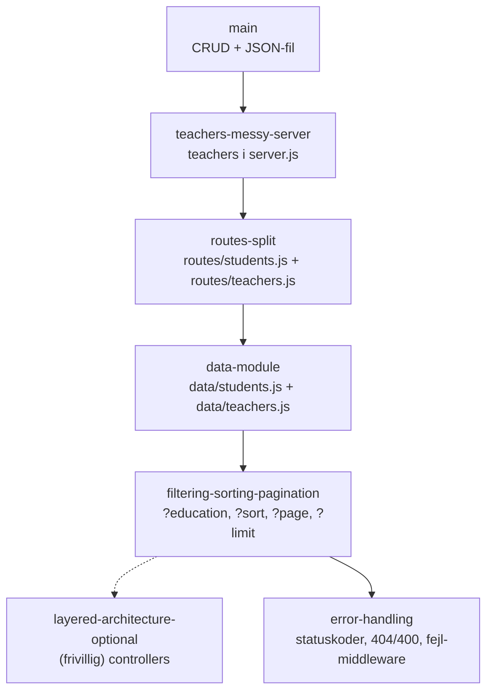

# Students REST API — løsningsforslag

Her er løsningsforslagene til students-opgaverne, samlet i ét repo. Hver branch viser, hvordan koden ser ud efter en bestemt opgave eller del. Brancherne følger den rækkefølge, du laver opgaverne i.

Sidder du fast, så find den del, du arbejder på, og sammenlign din kode med den branch, der hører til. Du kan også sammenligne to brancher. Så ser du præcis, hvad der ændrer sig fra et trin til det næste.

## Flow

Hver branch bygger videre på den forrige. Fejlhåndtering bygger på filtrering, sortering og paginering. Controllers er et frivilligt sidespor, som ikke fører videre.



## Brancher og opgaver

### 1. [REST API-øvelse: Studerende med CRUD](https://github.com/cederdorff/wu-e26a/blob/main/opgaver/express-rest-api-students.md)

[`main`](https://github.com/cederdorff/express-rest-api-students/tree/main) — løsning på hele øvelsen. Al koden ligger i `server.js`. Du har fuld CRUD for `/students`, og data gemmes i `data/students.json` med `loadStudents()` og `saveStudents()`.

### 2. [REST API-øvelse: Arkitektur — routes, data, controllers og filtrering](https://github.com/cederdorff/wu-e26a/blob/main/opgaver/express-rest-api-arkitektur.md)

Opgaven har fem dele. Hver del har sin egen branch.

1. `teachers-messy-server` — Del 1: Tilføj teachers til `server.js`\
   Du laver fuld CRUD for `/teachers` direkte i `server.js` med `data/teachers.json`. Det virker, men `server.js` bliver lang og rodet. Det er meningen, for det er det problem, de næste dele løser.
2. [`routes-split`](https://github.com/cederdorff/express-rest-api-students/tree/routes-split) — Del 2: Split i routes-filer\
   Routes for students og teachers flytter til `routes/students.js` og `routes/teachers.js` med `express.Router()`. `server.js` monterer dem med `app.use()`.
3. [`data-module`](https://github.com/cederdorff/express-rest-api-students/tree/data-module) — Del 3: Data-modul\
   `load`- og `save`-funktionerne flytter ud af routes og ind i `data/students.js` og `data/teachers.js`. Routes ved ikke længere, at data ligger i en JSON-fil.
4. [`filtering-sorting-pagination`](https://github.com/cederdorff/express-rest-api-students/tree/filtering-sorting-pagination) — Del 4: Filtrering, sortering og paginering\
   `GET /students` læser `request.query` og understøtter `?education=...`, `?sort=...` og `?page=...&limit=...`. `students.json` har flere studerende, så du kan se effekten.
5. [`layered-architecture-optional`](https://github.com/cederdorff/express-rest-api-students/tree/layered-architecture-optional) — Del 5 (frivillig): Controllers\
   Logikken i routes flytter til `controllers/studentsController.js` og `controllers/teachersController.js`. Routes-filerne kobler kun URL og metode til en controller-funktion.

Del 6 (courses og educations) har ingen branch. Her bruger du selv opskriften fra del 1–4.

### 3. [REST API-øvelse: Fejlhåndtering](https://github.com/cederdorff/wu-e26a/blob/main/opgaver/express-rest-api-fejlhaandtering.md)

- [`error-handling`](https://github.com/cederdorff/express-rest-api-students/tree/error-handling)\
  Bygger videre på `filtering-sorting-pagination`. Statuskoderne er eksplicitte (`201`, `204`). Du får `404`, hvis en studerende eller underviser ikke findes, og `400` ved manglende felter. Data-modulet bruger `try/catch`, og `server.js` har en fælles fejl-middleware og en 404-catch-all.

## Sådan bruger du brancherne

Hent repoet og installer pakkerne:

```sh
git clone https://github.com/cederdorff/express-rest-api-students.git
cd express-rest-api-students
npm install
```

Skift til den branch, du vil se, og start serveren:

```sh
git switch routes-split
npm run dev
```

Se, hvad der ændrer sig fra én del til den næste:

```sh
git diff routes-split data-module
```

Du kan også sammenligne på GitHub, fx [routes-split...data-module](https://github.com/cederdorff/express-rest-api-students/compare/routes-split...data-module).
