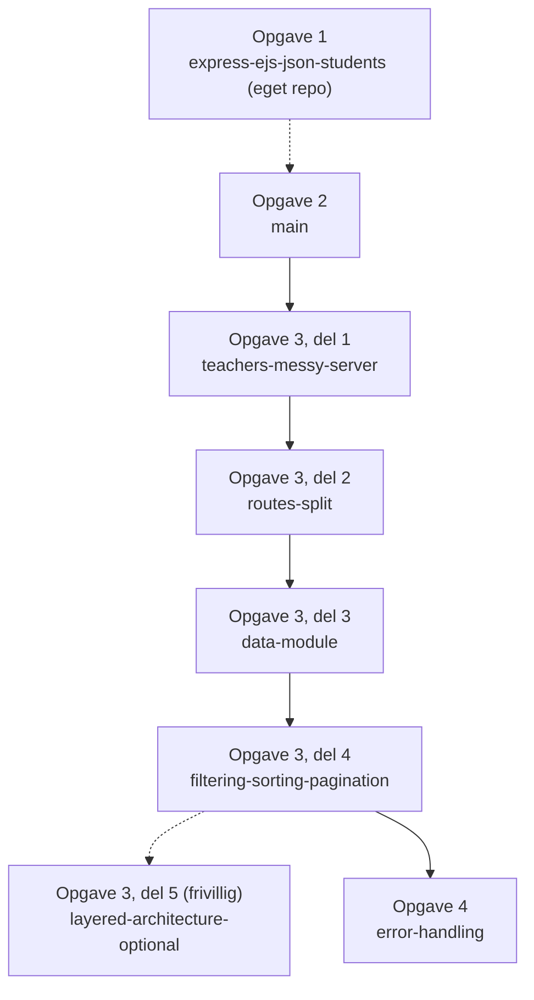
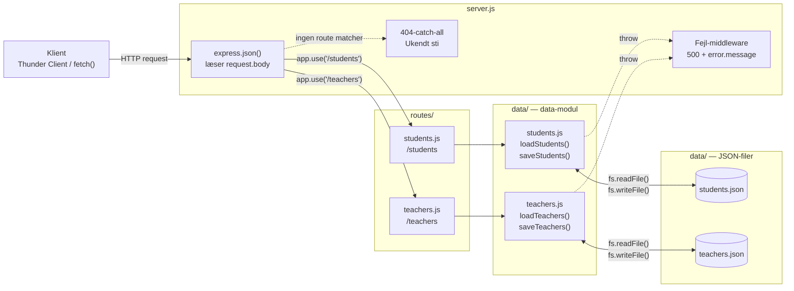
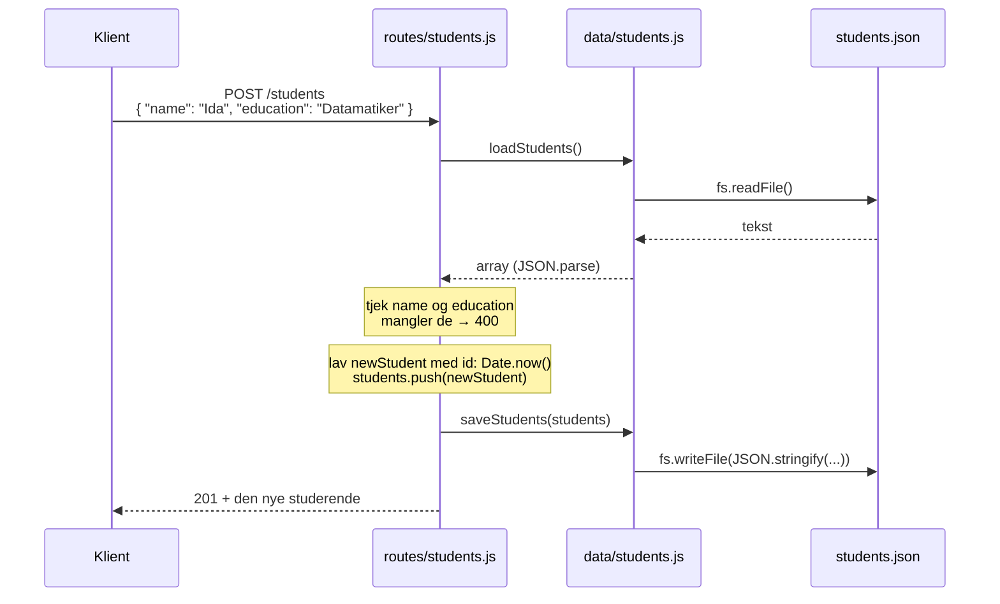

# Students REST API — løsningsforslag

Til hver students-opgave er der to dele:

- **Opgaven** er beskrivelsen af, hvad du skal lave, trin for trin. Den finder du i [wu-e26a/opgaver](https://github.com/cederdorff/wu-e26a/tree/main/opgaver).
- **Løsningen** er den færdige kode. Den ligger her i repoet som en branch. Hver branch viser koden, som den ser ud efter en bestemt opgave eller del.

Lav selv opgaven først. Sidder du fast, så find den del, du arbejder på, og sammenlign din kode med løsningen.

## Overblik: opgave → løsning

Lav hver students-opgave før den AMAbot-øvelse, den hører til.

| Opgave | Før AMAbot-øvelse | Del | Løsning (branch) |
| --- | --- | --- | --- |
| 1. JSON-øvelse: Studerende i en JSON-fil | 5 | hele opgaven | eget repo: [`express-ejs-json-students`](https://github.com/cederdorff/express-ejs-json-students) |
| 2. REST API-øvelse: Studerende med CRUD | 6 | hele opgaven | [`main`](https://github.com/cederdorff/express-rest-api-students/tree/main) |
| 3. REST API-øvelse: Arkitektur | 7 | Del 1: teachers i `server.js` | `teachers-messy-server` |
| | | Del 2: routes-filer | [`routes-split`](https://github.com/cederdorff/express-rest-api-students/tree/routes-split) |
| | | Del 3: data-modul | [`data-module`](https://github.com/cederdorff/express-rest-api-students/tree/data-module) |
| | | Del 4: filtrering, sortering, paginering | [`filtering-sorting-pagination`](https://github.com/cederdorff/express-rest-api-students/tree/filtering-sorting-pagination) |
| | | Del 5 (frivillig): controllers | [`layered-architecture-optional`](https://github.com/cederdorff/express-rest-api-students/tree/layered-architecture-optional) |
| | | Del 6 (frivillig): courses og educations | ingen løsning |
| 4. REST API-øvelse: Fejlhåndtering | 9 | hele opgaven | [`error-handling`](https://github.com/cederdorff/express-rest-api-students/tree/error-handling) |

## Flow mellem løsningerne

Løsningen til opgave 1 ligger i sit eget repo. `loadStudents()` og `saveStudents()` derfra går igen i opgave 2. I dette repo bygger hver branch videre på den forrige. Løsningen til fejlhåndtering bygger på filtrering, sortering og paginering. Controllers er et frivilligt sidespor, som ikke fører videre.



## Hvad løsningen gør

Her ser du den færdige løsning fra opgave 4 ([`error-handling`](https://github.com/cederdorff/express-rest-api-students/tree/error-handling)). De tidligere løsninger har det samme API, men med færre lag. I `main` ligger alt i `server.js`, og der er kun `/students`.

### Lagene i API'et

En request går gennem lagene fra venstre mod højre. Kun data-modulet ved, at data ligger i JSON-filer.



### Routes

`/students` og `/teachers` har de samme fem routes. En studerende har `name` og `education`, og en underviser har `name` og `subject`. `id` laver serveren selv med `Date.now()`.

| Metode | Sti | Body | Svar ved succes | Fejl |
| --- | --- | --- | --- | --- |
| `GET` | `/students` | – | `200` + liste | – |
| `GET` | `/students/:id` | – | `200` + én studerende | `404` |
| `POST` | `/students` | `{ "name", "education" }` | `201` + den nye studerende | `400` |
| `PUT` | `/students/:id` | `{ "name", "education" }` | `200` + den opdaterede studerende | `404`, `400` |
| `DELETE` | `/students/:id` | – | `204`, intet indhold | `404` |
| `GET` | `/teachers` | – | `200` + liste | – |
| `GET` | `/teachers/:id` | – | `200` + én underviser | `404` |
| `POST` | `/teachers` | `{ "name", "subject" }` | `201` + den nye underviser | `400` |
| `PUT` | `/teachers/:id` | `{ "name", "subject" }` | `200` + den opdaterede underviser | `404`, `400` |
| `DELETE` | `/teachers/:id` | – | `204`, intet indhold | `404` |
| alle | ukendt sti | – | – | `404` |

Kan en JSON-fil ikke læses, sender fejl-middlewaren `500`. Statuskoderne `201`, `204`, `400` og `404` kommer først med i opgave 4. Før da svarer alle routes med `200`.

`GET /students` kan også filtrere, sortere og paginere med query-parametre (fra opgave 3, del 4). Du kan kombinere dem:

| Query | Eksempel | Gør |
| --- | --- | --- |
| `education` | `/students?education=Datamatiker` | viser kun studerende på den uddannelse |
| `sort` | `/students?sort=name` | sorterer efter et felt, fx `name` eller `id` |
| `page` + `limit` | `/students?page=2&limit=2` | viser side 2 med 2 studerende pr. side |

### Sådan gemmes data

Data ligger som et array af objekter i en JSON-fil. `data/students.json` ser sådan ud:

```json
[
  { "id": 1, "name": "Aisha", "education": "Multimediedesign" },
  { "id": 2, "name": "Noah", "education": "Datamatiker" }
]
```

`data/teachers.json` er bygget på samme måde, bare med `subject` i stedet for `education`.

Alle routes, der ændrer data, følger samme mønster: **read → modify → write**. De læser hele filen, ændrer arrayet i memory og skriver hele arrayet tilbage. Her er `POST /students` som eksempel:



`PUT` og `DELETE` gør det samme. De finder den rigtige studerende med `find()`, ændrer eller fjerner den og gemmer hele arrayet igen. Fordi data ligger i en fil, overlever de en genstart af serveren.

## Opgaver og løsninger

### Opgave 1: JSON-øvelse — Studerende i en JSON-fil

**Opgave:** [express-ejs-json-students.md](https://github.com/cederdorff/wu-e26a/blob/main/opgaver/express-ejs-json-students.md), før AMAbot-øvelse 5\
En lille server med EJS, der læser og gemmer studerende i en JSON-fil. Du træner read → modify → write med `fs.readFile()` og `fs.writeFile()`.

**Løsning:** [`express-ejs-json-students`](https://github.com/cederdorff/express-ejs-json-students), et eget repo, branch `main`\
Serveren renderer studerende med EJS og gemmer dem i `data/students.json` med `loadStudents()` og `saveStudents()`.

### Opgave 2: REST API-øvelse — Studerende med CRUD

**Opgave:** [express-rest-api-students.md](https://github.com/cederdorff/wu-e26a/blob/main/opgaver/express-rest-api-students.md), før AMAbot-øvelse 6\
Et nyt projekt uden EJS. Du bygger fuld CRUD for `/students`, først med et array i memory og derefter med en JSON-fil.

**Løsning:** [`main`](https://github.com/cederdorff/express-rest-api-students/tree/main)\
Al koden ligger i `server.js`. Du har fuld CRUD for `/students`, og data gemmes i `data/students.json` med `loadStudents()` og `saveStudents()`.

### Opgave 3: REST API-øvelse — Arkitektur: routes, data, controllers og filtrering

**Opgave:** [express-rest-api-arkitektur.md](https://github.com/cederdorff/wu-e26a/blob/main/opgaver/express-rest-api-arkitektur.md), før AMAbot-øvelse 7\
Du tilføjer `/teachers`, deler API'et op i routes og et data-modul og tilføjer filtrering, sortering og paginering. Controllers er frivilligt.

**Løsninger:** én branch pr. del.

1. Del 1: Tilføj teachers til `server.js` → `teachers-messy-server`\
   Fuld CRUD for `/teachers` direkte i `server.js` med `data/teachers.json`. Det virker, men `server.js` bliver lang og rodet. Det er meningen, for det er det problem, de næste dele løser.
2. Del 2: Split i routes-filer → [`routes-split`](https://github.com/cederdorff/express-rest-api-students/tree/routes-split)\
   Routes for students og teachers flytter til `routes/students.js` og `routes/teachers.js` med `express.Router()`. `server.js` monterer dem med `app.use()`.
3. Del 3: Data-modul → [`data-module`](https://github.com/cederdorff/express-rest-api-students/tree/data-module)\
   `load`- og `save`-funktionerne flytter ud af routes og ind i `data/students.js` og `data/teachers.js`. Routes ved ikke længere, at data ligger i en JSON-fil.
4. Del 4: Filtrering, sortering og paginering → [`filtering-sorting-pagination`](https://github.com/cederdorff/express-rest-api-students/tree/filtering-sorting-pagination)\
   `GET /students` læser `request.query` og understøtter `?education=...`, `?sort=...` og `?page=...&limit=...`. `students.json` har flere studerende, så du kan se effekten.
5. Del 5 (frivillig): Controllers → [`layered-architecture-optional`](https://github.com/cederdorff/express-rest-api-students/tree/layered-architecture-optional)\
   Logikken i routes flytter til `controllers/studentsController.js` og `controllers/teachersController.js`. Routes-filerne kobler kun URL og metode til en controller-funktion.

Del 6 (courses og educations) har ingen løsning. Her bruger du selv opskriften fra del 1–4.

### Opgave 4: REST API-øvelse — Fejlhåndtering

**Opgave:** [express-rest-api-fejlhaandtering.md](https://github.com/cederdorff/wu-e26a/blob/main/opgaver/express-rest-api-fejlhaandtering.md), før AMAbot-øvelse 9\
Du gør statuskoderne eksplicitte, tilføjer `404`- og `400`-tjek og samler fejl i en fælles fejl-middleware.

**Løsning:** [`error-handling`](https://github.com/cederdorff/express-rest-api-students/tree/error-handling)\
Bygger videre på `filtering-sorting-pagination`. Statuskoderne er eksplicitte (`201`, `204`). Du får `404`, hvis en studerende eller underviser ikke findes, og `400` ved manglende felter. Data-modulet bruger `try/catch`, og `server.js` har en fælles fejl-middleware og en 404-catch-all.

## Sådan bruger du løsningerne

Hent repoet og installer pakkerne:

```sh
git clone https://github.com/cederdorff/express-rest-api-students.git
cd express-rest-api-students
npm install
```

Skift til den løsning (branch), du vil se, og start serveren:

```sh
git switch routes-split
npm run dev
```

Se, hvad der ændrer sig fra én del til den næste:

```sh
git diff routes-split data-module
```

Du kan også sammenligne på GitHub, fx [routes-split...data-module](https://github.com/cederdorff/express-rest-api-students/compare/routes-split...data-module).
